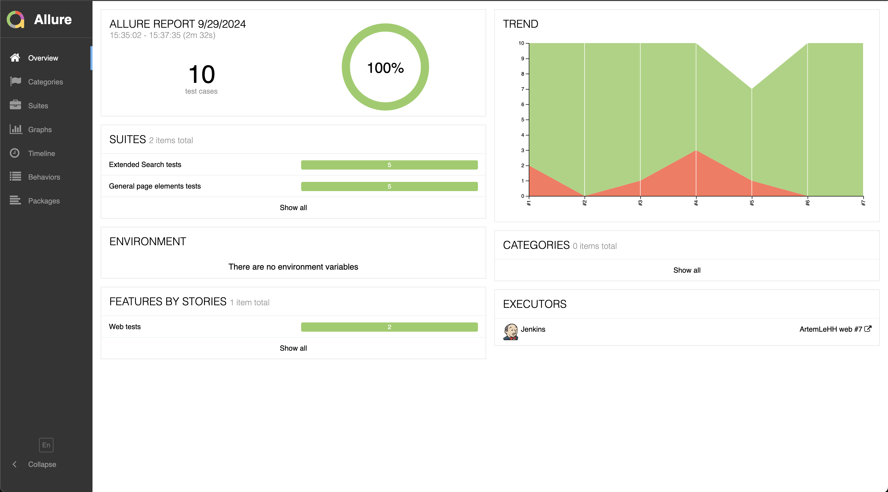
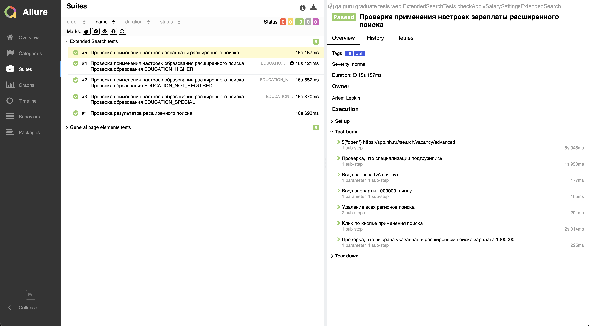
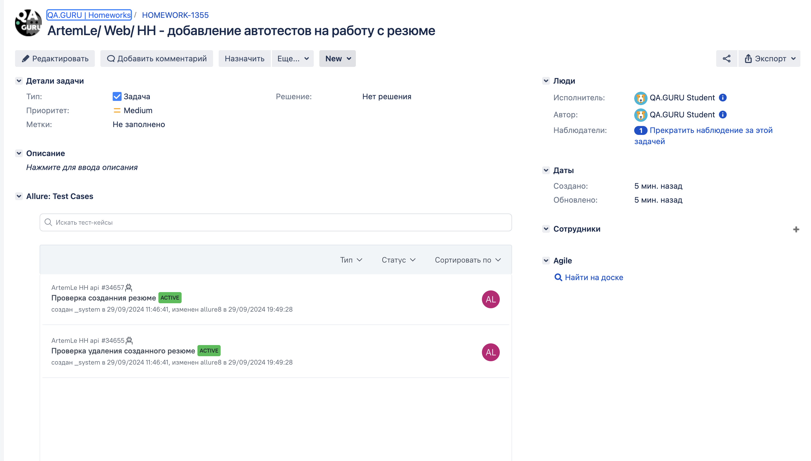
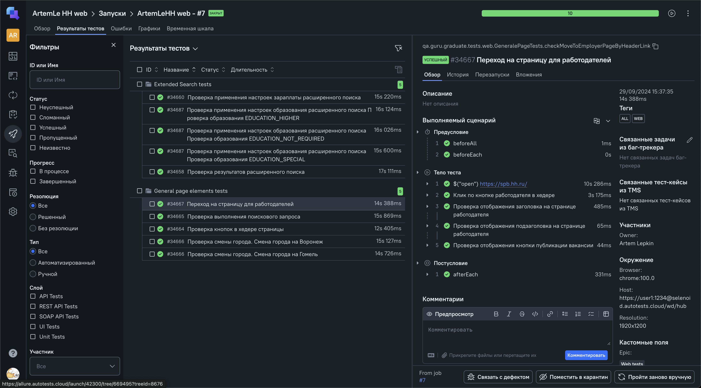
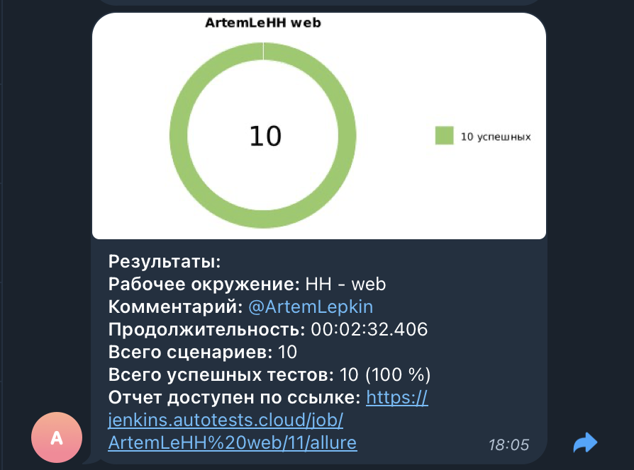

# Проект автоматизации тестирования сервиса HeadHunter

## Содержание
1. [Описание](#описание)
2. [Ссылки](#ссылки)
3. [Использованные Технологии и инструменты](#использованные-технологии-и-инструменты)
4. [Запуск тестов](#запуск-тестов)
   - [Локальный запуск тестов](#локальный-запуск-тестов)
   - [Параметры web тестов](#параметры-web-тестов)
   - [Параметры android тестов](#параметры-android-тестов)
   - [Сборка тестов в Jenkins](#сборка-тестов-в-jenkins)
5. [Интеграции](#интеграции)
   - [Интеграция с Allure report](#интеграция-с-allure-report)
   - [Интеграция с Allure TestOps](#интеграция-с-allure-testops)
   - [Уведомления в Telegram](#уведомления-в-telegram-с-использованием-бота)
6. [Технические особенности](#технические-особенности)

## Описание

Данный проект направлен на автоматизацию Web/ API/ Android тестов для сервиса headhunter.  <br/>
Headhunter - сервис, который помогает найти работу и подобрать персонал. <br/>

## Ссылки

### Jenkins: 
- Джоба запуска [api автотестов](https://jenkins.autotests.cloud/view/ArtemLe/job/ArtemLeHH%20api/)
- Джоба запуска [android автотестов](https://jenkins.autotests.cloud/view/ArtemLe/job/ArtemLeHH%20Mobile/)
- Джоба запуска [web автотестов](https://jenkins.autotests.cloud/view/ArtemLe/job/ArtemLeHH%20web/)

### Test ops
- Проект [api автотестов](https://allure.autotests.cloud/project/4451)
- Проект [android автотестов](https://allure.autotests.cloud/project/4452)
- Проект [web автотестов](https://allure.autotests.cloud/project/4450/dashboards)

## Использованные Технологии и инструменты

<div align="center">
<a href="https://www.jetbrains.com/idea/"></a>
<a href="https://www.java.com/"></a>
<a href="https://gradle.org/"></a>  
<a href="https://junit.org/junit5/"></a>
<a href="https://selenide.org/"></a>
<a href="https://aerokube.com/selenoid/"></a>
<a href="https://rest-assured.io/"></a>
<a href="https://www.browserstack.com/"></a>
<a href="https://appium.io/"></a>
<a href="https://developer.android.com/studio"></a>
<a href="https://www.jenkins.io/"></a>
<a href="https://qameta.io/"></a>
<a href="https://telegram.org/"></a>
<a href="https://telegram.org/"></a>
   <a href="https://telegram.org/"></a>
</div>

## Запуск тестов
### Локальный запуск тестов

Для запуска следует открыть IntelliJ IDEA и выполнить в терминале:

- Для запуска всех тестов
```
gradle clean test
```
или
```
gradle clean test -Dtag=all
```
-  WEB
```
gradle clean -Dtag=web
```
- API
```
gradle clean -Dtag=api 
```
- Mobile
```
gradle clean -Dtag=mobile
```

#### Параметры web тестов

```
-Dbrowser - наименование браузера (значение по умолчанию: chrome)
-DbrowserVersion - номер версии браузера (значение по умолчанию: 129.0)
-Dresolution - размер окна браузера.(значение по умолчанию: 1980x1080)
-DremoteUrl - адрес удаленного сервера, на котором будут запускаться тесты
```

#### Параметры android тестов

```
-DdeviceHost - метод запуска (значение по умолчанию: browserstack). Возможные значения: 
  -- browserstack - для запуска на browserstack
  -- emulation - для запуска на эмуляторе
  -- real - для запуска на реальном устройстве, которое подключено
```
> [!NOTE]
> Дополнительные параметры запуска для browserstack, emulation и real хостов не нужно передавать в формате переменных.
> Благодаря библиотеке owner достаточно менять их в конфигурационных файлах `.properties`, которые лежат в папке `resources`. <br/>

<details>
   <summary>Дополнительные команды:</summary>

1. Выполнить запрос на формирование отчета:

```
gradle allureReport
```

2. Открыть отчет в браузере:

```
gradle allureServe
```

</details>

### Сборка тестов в Jenkins
>#### <b><a target="_blank" href="https:/jenkins.autotests.cloud/view/ArtemLe/job/ArtemLe_HH_web/">Web</a></b>
> Для запуска сборки необходимо перейти в раздел `Build with Parameters`, если требуется выбрать нужные параметры
> BROWSER или RESOLUTION и нажать кнопку `Build`

> #### <b><a target="_blank" href="https://jenkins.autotests.cloud/view/ArtemLe/job/ArtemLeHH%20Mobile/">Mobile</a></b>
> Для запуска сборки необходимо перейти в раздел `Build with Parameters`, если требуется выбрать нужный параметр
> ENV и нажать кнопку `Build`

> #### <b><a target="_blank" href="https://jenkins.autotests.cloud/view/ArtemLe/job/ArtemLeHH%20api/">Api</a></b>
> У сборки нет параметров, достаточно нажать  `Build Now`.

## Интеграции
### Интеграция с <b><a target="_blank" href="https://jenkins.autotests.cloud/view/ArtemLe/job/ArtemLe_HH_web/allure/">Allure report</a></b>

#### Пример прохождения автотестов:

   
   

### Интеграция с <b><a target="_blank" href="https://jira.autotests.cloud/browse/">Jira</a></b>

#### Пример задачи в jira:

   

### Интеграция с <b><a target="_blank" href="https://allure.autotests.cloud/project/4450/dashboards">Allure TestOps</a></b>
#### Пример прохождения автотестов:



### Уведомления в Telegram с использованием бота

> Бот, созданный в Telegram, после завершения сборки отправляет сообщение с отчетом о прохождении тестов
>


## Технические особенности

> [!NOTE]
> Убедитесь, что у вас установлены Java, Gradle, IntelliJ IDEA, Appium server.
> Для mobile тестов - подключено устройство или установлен эмулятор и запущен Appium Server

